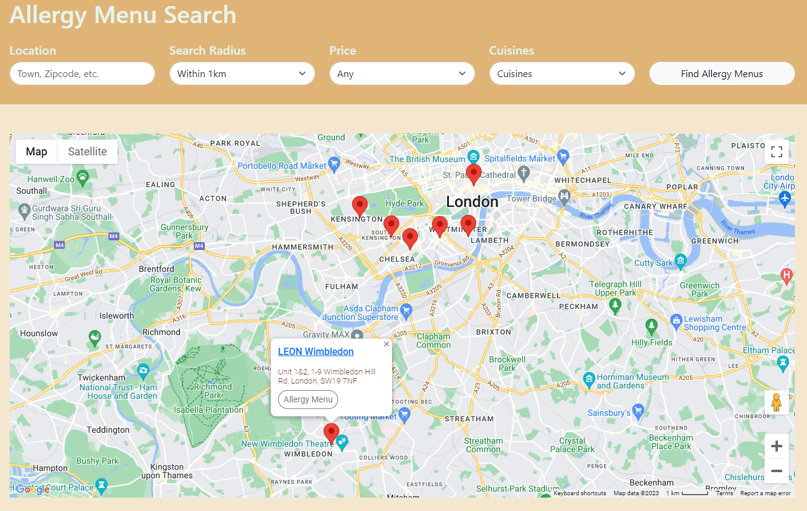

# Allergy Menu Map
Flask app to help users find restaurants with online allergy menus near them

# Repository Description:



This is a Python-based web application that helps users find restaurants that have an online allergy menu, powered by Flask. The app utilizes Google Maps API to identify restaurant locations and manages the information in an SQL lite database. Users can use the search function to look for restaurants in specific locations, price points and cuisines, with results being returned on a Google Map frame. Users are able to register an account and log in. Registed users are also able to submit restaurants with allergy menus, choose which restaurants to add to their favourites, and report restaurants with incorrect information. Admins have access to the entire database of users, restaurants, and reports, freely adding and editing the database.

# Project Organization:

The project consists of the following directories and files:

```
├── application/ 
│   ├── admin/
│   │   ├── __init__.py
│   │   ├── admin_forms.py
│   │   └── routes.py
│   ├── login_functionality/
│   │   ├── __init__.py
│   │   ├── login_functionality_forms.py
│   │   └── routes.py
│   ├── managers/
│   │   ├── geolocation_manager.py
│   │   ├── map_manager.py
│   │   ├── price_dict.py
│   │   └── search_engine.py
│   ├── login_functionality/
│   │   ├── __init__.py
│   │   ├── public_forms.py
│   │   └── routes.py
│   ├── static/
│   │   ├── css/
│   │   │   └── styles.css
│   │   └── images/
│   ├── templates/
│   │   ├── admin/
│   │   ├── login_functionality/
│   │   ├── public/
│   │   ├── users/
│   │   ├── footer.html
│   │   ├── header.html
│   │   └── navbar.html
│   ├── users/
│   │   ├── __init__.py
│   │   ├── user_forms.py
│   │   └── routes.py
│   ├── __init__.py
│   ├── extensions.py
│   ├── models.py
├── instance/
│   └── test_app.py
├── migrations/
│   └── test_app.py
├── config.py
├── requirements.txt
└── run.py
```

application/: Contains the main source code for the web application, including routes, assets, forms, and templates.

instance/: Contains SQL lite database for the application.

migrations/: Contains the various migrations for the SQL lite database for the application.

config.py: Contains the configuration settings for the application.

requirements.txt: Lists the required packages and dependencies for the application.

run.py: The entry point for the application.

# First Time Set-up:

1. Clone the repository:

```$ git clone https://github.com/AntonyQuang/Allergy-Menu-Map.git```

2. Create a virtual environment and activate it:

```$ python3 -m venv env 
$ source env/bin/activate`
```
3. Install the required packages:

```$ pip install -r requirements.txt```

Ensure that the Flask-Googlemaps package in installed from [this github link](https://github.com/flask-extensions/Flask-GoogleMaps/releases/tag/0.4.1.1)

If you wish to do this separately you can do so with

```$pip install https://github.com/flask-extensions/Flask-GoogleMaps/archive/refs/tags/0.4.1.1.tar.gz```

4. Set up your individual .env file which contains:
 - Your Google API Key
 - Your Flask Secret Key
 - Your SQL Alchemy database uri
 - Your ipinfo token

5. Set up the database:

```
$ export FLASK_APP=run.py
$ flask db init
$ flask db migrate
$ flask db upgrade`
```
6. Run the application:

`  $ flask run`

# Persistent Environments:

This application uses a SQLite database by default. To switch to a different database, update the SQLALCHEMY_DATABASE_URI in config.py.

# Deployment:

The application can be deployed to a production environment using a web server such as Gunicorn or uWSGI.

# Code Style and Standards:

This project follows the PEP 8 (python.org/dev/peps/pep-0008/) coding style guidelines.

# License Information:

This project is licensed under the MIT License (opensource.org/licenses/MIT).

# Status and Roadmap

The application is currently in a functional state, but there is still room for improvement and new features to be added. The project roadmap includes transferring the database to a PostgreSQL database format, improving the website scalability, and integrating email functions.
